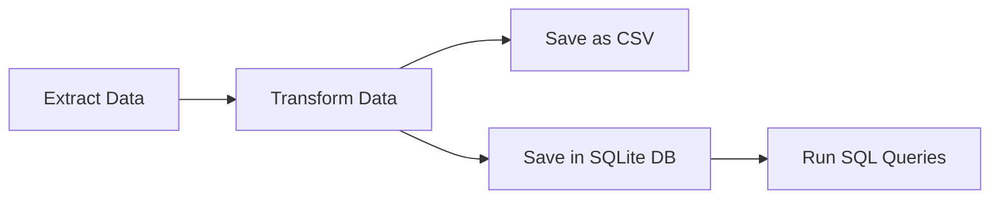

# ETL Pipeline: Top Banks by Market Capitalization

This project demonstrates building an **ETL (Extract, Transform, Load) pipeline** using Python to extract the top banks' market capitalization data, transform it into multiple currencies, and store it in both a CSV file and a SQLite database.  

---

## Project Overview

The pipeline performs the following tasks:

1. **Extract**  
   - Fetches banks' market capitalization data from a Wikipedia page archived on **archive.org**.  
   - Uses the **Requests** library to make HTTP requests.  
   - Parses the HTML using **BeautifulSoup**.  

2. **Transform**  
   - Cleans and converts market capitalization values.  
   - Converts values from **USD** to **GBP, EUR, and INR** using exchange rate data from a CSV file.  

3. **Load**  
   - Saves the final dataset as:  
     - **CSV file**  
     - **SQLite database** (`Banks.db`)  

4. **Query**  
   - Runs SQL queries on the database, such as:  
     - Displaying all bank records  
     - Calculating the average Market Cap in GBP  
     - Displaying the first 5 banks  

---

## Technologies Used

- **Python 3**  
- **Libraries**:  
  - `pandas` → data handling  
  - `numpy` → numeric operations  
  - `requests` → HTTP requests  
  - `BeautifulSoup` → HTML parsing  
  - `sqlite3` → database operations  
  - `lxml` → HTML parser  

---

## Pipeline Workflow



---

## Key Functions

- `preliminaries()` → Initializes URLs, file paths, and table attributes  
- `log_progress(message)` → Logs ETL progress with timestamps  
- `extract(url)` → Extracts bank names and market cap in USD from Wikipedia archive  
- `transform(df)` → Converts USD market caps into GBP, EUR, INR  
- `to_csv(df, path)` → Saves dataset as CSV  
- `to_sql(df, db_name, table)` → Saves dataset into SQLite database  
- `run_query(query, db_name)` → Executes SQL queries and returns results  

---

## Dataset Outputs

- **CSV File**: `Largest_banks_data.csv`  
- **Database**: `Banks.db` → Table: `Largest_banks`  

---

## Example Queries

```sql
-- Select all banks
SELECT * FROM Largest_banks;

-- Average Market Cap in GBP
SELECT AVG(MC_GBP_Billion) FROM Largest_banks;

-- First 5 banks by name
SELECT Name FROM Largest_banks LIMIT 5;
```

---

## How to Run

1. Clone the repository:
   ```bash
   git clone https://github.com/your-username/ELT_pipeline_python_example.git
   cd etl-banks-marketcap
   ```

2. Install dependencies:
   ```bash
   pip install pandas numpy requests beautifulsoup4 lxml
   ```

3. Run the script:
   ```bash
   python etl_pipeline.py
   ```

---

## Project Logs

- A `logfile.txt` is maintained to track ETL progress and execution time.  

Example log entry:
```
2025-Oct-07-14:35:01: Preliminaries complete. Initiating ETL process
2025-Oct-07-14:35:05: Data extraction complete. Initiating Transformation process
```

---

## Future Enhancements

- Automate ETL execution with **Airflow** or **Prefect**.  
- Add **visualizations** for market capitalization.  
- Deploy as a scheduled job in the cloud.  

---

## License

This project is licensed under the **MIT License** – you are free to use, modify, and distribute it with attribution.  
